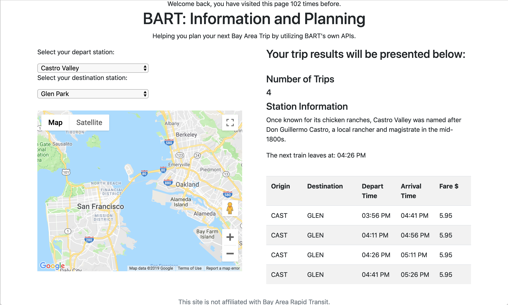
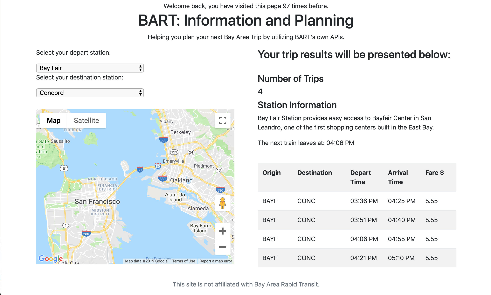
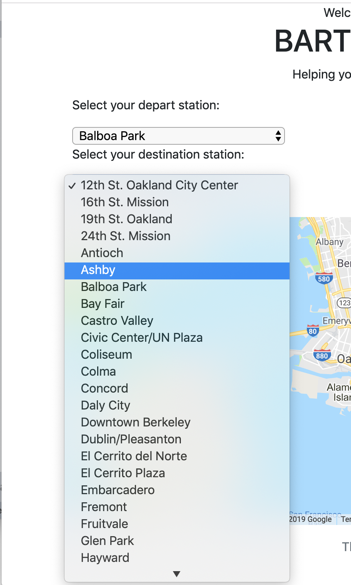
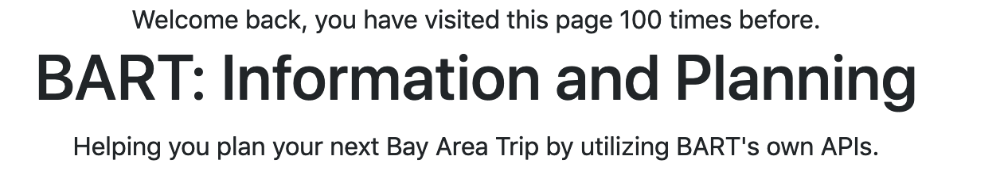

# BART-Trip-Planner
Allows people to get information on the BART system and plan trips and calculates costs. Using BART's public APIs. Project used HTML, CSS, JS, JSON, Cookies, and was hosted on AWS EC2.

## Images
* Images of application, when it was hosted on an AWS EC2 Linux instance.

## Results
* Fetched using BART's station information API.

## Stations
* Returns live result of active stations.

## Cookies
* Lets the user know if they are a returning user of the website.

